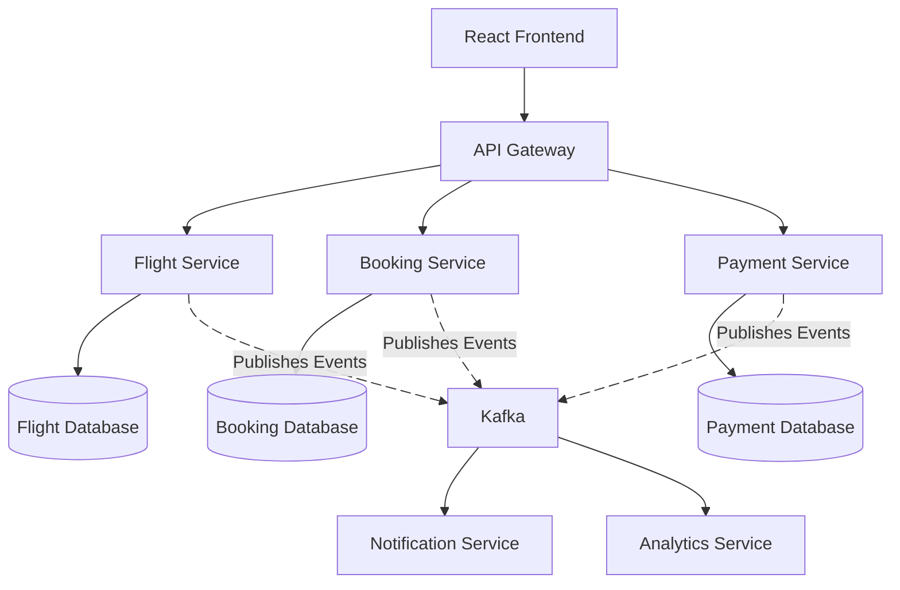

# FlightBookingSystem

Software Architecture 

                      # Flight Booking System Architecture

#Resources
 [Introduction to Kafka] 
 https://kafka.apache.org/43/getting-started/introduction 

